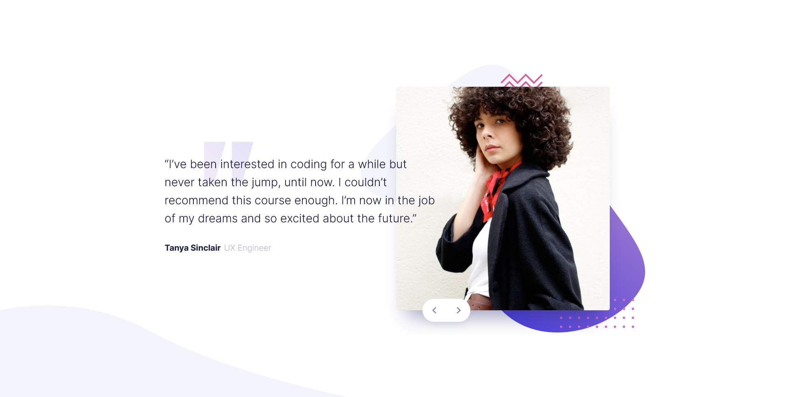

# Frontend Mentor - Coding bootcamp testimonials slider solution

This is a solution to the [Coding bootcamp testimonials slider challenge on Frontend Mentor](https://www.frontendmentor.io/challenges/coding-bootcamp-testimonials-slider-4FNyLA8JL). Frontend Mentor challenges help you improve your coding skills by building realistic projects. 

## Table of contents

- [Overview](#overview)
  - [The challenge](#the-challenge)
  - [Screenshot](#screenshot)
  - [Links](#links)
- [My process](#my-process)
  - [Built with](#built-with)
  - [What I learned](#what-i-learned)
  - [Continued development](#continued-development)
  - [Useful resources](#useful-resources)
- [Author](#author)
- [Acknowledgments](#acknowledgments)

## Overview

### The challenge

Users should be able to:

- View the optimal layout for the component depending on their device's screen size
- Navigate the slider using either their mouse/trackpad or keyboard

### Screenshot



### Links

- [View the live page here](https://testimonial-slider-sage.vercel.app/)

## My process

### Built with

- Semantic HTML5 markup
- Flexbox
- CSS Grid
- Mobile-first workflow
- Vanilla JavaScript

### What I learned

Positioning images of bootcamp graduates in a way that was close to the design and looked well on all devices proved to be the most challenging element of this project. Eventually, I decided to set the images as background in my CSS. To ensure that they would still be accessible to screen reader users, I added `role="img"` and set an `aria-label` to the `<div>` they are on.

To animate the slider, I initially used `@keyframes` animations. However, this meant that in JavaScript, I repeatedly added and removed classes to achieve the desired effect. To simplify this, I decided to skip animations and rely on simple transition, instead. Thanks to this, my code became a lot cleaner and more readable. You can see this below: the first code snippet shows initial code, and the second snippet shows the final version.

```js
// this is the initial code, relying on @keyframes animation
function getTestimonial() {

    image.classList.remove('fade-from-right');
    image.classList.add('fade-to-right');

    image.addEventListener('animationend', (e) => {
        if (e.animationName === 'fade-to-right') {
            image.style.backgroundImage = `url(${testimonials[index].image})`;
            image.setAttribute("aria-label", `${testimonials[index].alt}`);
        }
        image.classList.remove('fade-to-right');
        image.classList.add('fade-from-right');
    })

    copy.classList.remove('fade-from-left');
    copy.classList.add('fade-to-left');

    copy.addEventListener('animationend', (e) => {
        if(e.animationName === 'fade-to-left') {
            person.textContent = `${testimonials[index].name}`;
            role.textContent = `${testimonials[index].role}`;
            text.textContent = `${testimonials[index].text}`;
        }

        copy.classList.remove('fade-to-left');
        copy.classList.add('fade-from-left');
    })
}
```
```js
// the final function, slider effect based on CSS transitions
function getTestimonial() {

    image.classList.add('fade-to-right');
    image.addEventListener('transitionend', () => {
        image.style.backgroundImage = `url(${testimonials[index].image})`;
        image.setAttribute("aria-label", `${testimonials[index].alt}`);
        image.classList.remove('fade-to-right');
    })

    copy.classList.add('fade-to-left');
    copy.addEventListener('transitionend', () => {
        person.textContent = `${testimonials[index].name}`;
        role.textContent = `${testimonials[index].role}`;
        text.textContent = `${testimonials[index].text}`;
        copy.classList.remove('fade-to-left');
    })
}
```

### Continued development

Use this section to outline areas that you want to continue focusing on in future projects. These could be concepts you're still not completely comfortable with or techniques you found useful that you want to refine and perfect.

**Note: Delete this note and the content within this section and replace with your own plans for continued development.**


## Author

- Frontend Mentor - [@AgataLiberska](https://www.frontendmentor.io/profile/AgataLiberska)


